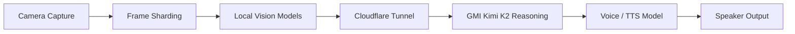

# DisOps

**Real-time vision-to-voice emergency guidance.**

DisOps is a live disaster-response agent. It watches a camera stream, detects hazards with local/cloud vision models, reasons about the safest next move with **GMI Kimi K2**, and **speaks** calm instructions back to the user in real time — all surfaced through a dark, command-center web UI.

> ⚠️ **Safety:** AI guidance may be imperfect. In a real emergency, follow official instructions and contact emergency services when it is safe to do so. The "Call Emergency Services" button is a UI placeholder and does not place real calls.

---

## What it does

A person opens DisOps during a possible emergency. The camera is live. The system:

1. **Captures** frames from the camera.
2. **Analyzes** each frame with a vision model (GMI multimodal LLM, Nemotron, or Gemini fallback) to produce a structured scene description and detected hazards.
3. **Reasons** about the situation with GMI Kimi K2, returning a brief, user-safe assessment: urgency, situation, safest next action, and short reasoning (no chain-of-thought).
4. **Speaks** the guidance through text-to-speech so the user hears the next safest action instantly.

Every stage is streamed live to the browser over a WebSocket, with per-stage latency so the audience can see the agent working — this is not a chatbot.

---

## Pipeline



The UI renders this exact graph and pulses the active stage with real timings, e.g. `Vision: 5206ms · Kimi K2: 3092ms · TTS: 180ms`.

---

## Features

- **Large live video feed** with `LIVE` badge, frame timestamp, and animated hazard overlay boxes (fire, smoke, flood water, blocked exit, debris, person down, …).
- **Emergency Guidance panel** — big urgency badge (Low / Medium / High / Critical), situation title, large spoken-guidance card, live voice waveform, and Replay / Mute / Call Emergency Services controls.
- **Live pipeline visualization** with idle / processing / complete / error states and per-stage durations.
- **Scene Analysis** and **Agent Reasoning** cards (confidence-aware: cautious language when confidence is low).
- **Live event timeline** that reads like a production log.
- **Session controls**: Start / Pause / Snapshot / Replay / Mute / Clear + a Demo Mode toggle.
- **Demo Mode** with scripted, realistic scenarios so the app runs end-to-end with **no API keys**.
- Four distinct urgency visual states, a critical full-screen banner, responsive/mobile fallback, and a persistent safety notice.

---

## Quickstart

### 1. Install

```bash
git clone git@github.com:chetas1208/DisOps.git
cd DisOps
pip install -r requirements.txt
```

### 2. (Optional) Configure live backends

Demo Mode runs with no keys. For **real live-camera analysis**, create a `.env` (auto-loaded on startup):

```bash
# Vision: GMI Cloud multimodal LLM (primary)
GMI_API_KEY=your-gmi-key
GMI_LLM_ENDPOINT_URL=https://api.gmi-serving.com
GMI_VISION_MODEL=openai/gpt-5.5
GMI_REASONING_MODEL=moonshotai/kimi-k2.7-code-highspeed
GMI_MAX_COMPLETION_TOKENS=256
GMI_REQUEST_TIMEOUT_S=30

# Vision: Nemotron Omni over a Cloudflare tunnel (secondary)
NEMOTRON_ENDPOINT_URL=https://<your-tunnel>.trycloudflare.com

# Vision: Gemini (fallback)
GEMINI_API_KEY=your-gemini-key

# Voice (optional CLI pipeline)
ELEVENLABS_API_KEY=your-elevenlabs-key
```

> `.env` is gitignored — secrets are never committed.

### 3. Run

```bash
python app.py
# or choose host/port:
HOST=0.0.0.0 PORT=8000 python app.py
```

Open **http://localhost:8000**, click **Start Session**, and pick a scenario (Demo Mode) — or allow camera access to go fully live.

---

## Live vs Demo Mode

| | Demo Mode (default) | Live Mode |
|---|---|---|
| Source | Scripted scenarios (`server/scenarios.py`) | Your camera frames |
| Requires | Nothing | Camera + `GMI_API_KEY` |
| Cadence | One frame every 2–3s | Adaptive — as fast as the models return (~5–8s/frame) |
| Pipeline | Simulated timings | Real GMI vision → Kimi K2 reasoning |

When you **Start Session** with a camera and a live vision backend available, DisOps automatically switches out of Demo Mode and streams real frames. Each frame is captured, sent to `/api/frame`, analyzed (vision → Kimi K2), and the result is broadcast back over the WebSocket. The frontend captures the next frame the moment the previous result arrives — no fixed timer, no overlapping requests. Clear frames skip the reasoning call (vision-only, faster); hazard frames run the full pipeline.

---

## Project structure

```
DisOps/
├── app.py                     # Entry point: loads .env, runs uvicorn
├── server/                    # FastAPI web app
│   ├── api.py                 # REST control plane + WebSocket + static UI
│   ├── orchestrator.py        # Session state, demo loop, WebSocket fan-out
│   ├── pipeline.py            # Live frame → vision → Kimi K2 → PipelineEvent
│   ├── reasoning.py           # GMI Kimi K2 emergency-reasoning step
│   ├── scenarios.py           # Scripted demo scenarios
│   └── models.py              # PipelineEvent / LogEntry schema
├── web/                       # Frontend (no build step)
│   ├── index.html
│   ├── css/styles.css
│   └── js/main.js             # All UI components + WebSocket + camera loop
├── vision_router.py           # GMI → Nemotron → Gemini fallback chain
├── vision_core.py             # Gemini vision + result parsing/contract
├── vision_core_gmi.py         # GMI Cloud multimodal vision backend
├── vision_core_nemotron.py    # Nemotron Omni vision backend
├── voice_router.py            # Nemotron → ElevenLabs fallback chain
├── voice_output*.py           # TTS backends
├── debounce.py                # Guidance debounce helper
├── test_images/               # Sample frames
└── requirements.txt
```

---

## Backend API

The single FastAPI process serves the UI **and** the pipeline.

### REST

| Method | Path | Body | Description |
|---|---|---|---|
| `GET` | `/api/health` | — | Liveness + current session status |
| `GET` | `/api/state` | — | Full snapshot (status, scenarios, last event, log) |
| `GET` | `/api/scenarios` | — | Demo scenario catalog |
| `POST` | `/api/start` | — | Start a monitoring session |
| `POST` | `/api/stop` | — | Stop the session |
| `POST` | `/api/pause` | `{"enabled": bool}` | Pause / resume |
| `POST` | `/api/mute` | `{"enabled": bool}` | Mute / unmute voice |
| `POST` | `/api/demo-mode` | `{"enabled": bool}` | Toggle Demo vs Live |
| `POST` | `/api/scenario` | `{"scenario": str}` | Select a demo scenario |
| `POST` | `/api/snapshot` | — | Log a snapshot event |
| `POST` | `/api/replay` | — | Replay the last guidance |
| `POST` | `/api/clear` | — | Clear session + log |
| `POST` | `/api/frame` | `{"frame": "data:image/...;base64,..."}` | Analyze one live frame |

### WebSocket `/ws`

The client receives JSON messages of the form `{ "type": ..., "data": ... }`:

- `snapshot` — full state on connect
- `status` — session flags changed
- `event` — one analyzed frame (the `PipelineEvent`)
- `log` — a new timeline entry
- `pipeline_progress` / `pipeline_reset` — stage animation
- `replay`, `cleared`

### Event shape (example)

```json
{
  "frame_id": "frame_023",
  "urgency": "High",
  "scene_summary": "Smoke visible near doorway in indoor hallway.",
  "situation": "Possible smoke or fire hazard near an exit route.",
  "voice_guidance": "Move away from the smoke. Stay low and find another clear exit.",
  "reasoning_summary": "Smoke near an exit can indicate fire risk or unsafe air quality.",
  "next_check": "Check whether smoke is spreading and whether another exit is visible.",
  "detected_hazards": ["smoke", "blocked_exit"],
  "detected_objects": ["door", "person", "smoke"],
  "confidence": 0.87,
  "latency_ms": 420,
  "stage_durations": {"vision_models": 180, "kimi_k2": 620, "tts": 210},
  "source": "live"
}
```

---

## Environment variables

| Variable | Used by | Default |
|---|---|---|
| `GMI_API_KEY` | GMI vision + Kimi K2 reasoning | — (enables live mode) |
| `GMI_LLM_ENDPOINT_URL` | GMI base URL | `https://api.gmi-serving.com` |
| `GMI_VISION_MODEL` | GMI vision model | `XiaomiMiMo/MiMo-V2.5` |
| `GMI_REASONING_MODEL` | Kimi K2 reasoning model | `moonshotai/kimi-k2.7-code-highspeed` |
| `GMI_MAX_COMPLETION_TOKENS` | GMI token budget | `256` |
| `GMI_REQUEST_TIMEOUT_S` | GMI HTTP timeout | `30` |
| `NEMOTRON_ENDPOINT_URL` | Nemotron vision (Cloudflare tunnel) | built-in tunnel |
| `GEMINI_API_KEY` | Gemini vision fallback | — |
| `ELEVENLABS_API_KEY` | ElevenLabs voice fallback | — |
| `HOST` / `PORT` | Web server bind | `0.0.0.0` / `8000` |

Vision backends are tried in order: **GMI → Nemotron → Gemini**. Voice backends: **Nemotron → ElevenLabs**.

---

## Notes & limitations

- Live camera capture and browser text-to-speech require a **secure context** — use `http://localhost` or an SSH tunnel; a raw `http://<ip>` origin may have the camera blocked by the browser.
- Live analysis runs at the genuine pace of the models (~5–8s/frame); this is real reasoning latency, not a throttle.
- The "Call Emergency Services" action is a UI placeholder.
- The frontend has no build step — it is plain HTML/CSS/ES-module JS served directly.

---

## License

Demo project built for an AI agents hackathon.
